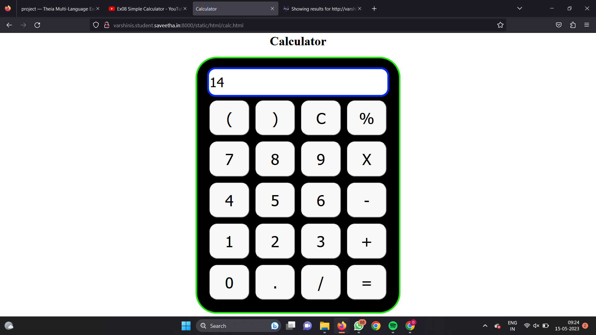

## DESIGN STEPS:

## Step 1:
Clone the repository from Github.
## Step 2:
Start a django project and make necessary changes
## Step 3:
Create HTML, CSS and JAVASCRIPT program for the calculator
## Step 4:
CSS for design and JavaScript for the calculator
## Step 5:
Validate HTML, CSS and JavaScript code.
## Step 6:
Validate the HTML and CSS code.
## Step 7:
Publish your URL and test the Calculator
## PROGRAM :

HTML
<!DOCTYPE html>
<html lang="en">
<head>
 <meta charset="UTF-8">
 <meta name="viewport" content="width=device-width, initial-scale=1.0">
 <meta http-equiv="X-UA-Compatible" content="ie=edge">
 <link rel="stylesheet" href="/static/CSS/style.css">
 <title>Calculator</title>
</head>
<body>
 

 <h1>Calculator</h1>
 

 <input type="text" name="screen" id="screen">
 <table>
 <tr>
 <td><button>(</button></td>
 <td><button>)</button></td>
 <td><button>C</button></td>
 <td><button>%</button></td>
 </tr>
 <tr>
 <td><button>7</button></td>
 <td><button>8</button></td>
 <td><button>9</button></td>
 <td><button>X</button></td>
 </tr>
 <tr>
 <td><button>4</button></td>
 <td><button>5</button></td>
 <td><button>6</button></td>
 <td><button>-</button></td>
 </tr>
 <tr>
 <td><button>1</button></td>
 <td><button>2</button></td>
 <td><button>3</button></td>
 <td><button>+</button></td>
 </tr>
 <tr>
 <td><button>0</button></td>
 <td><button>.</button></td>
 <td><button>/</button></td>
 <td><button>=</button></td>
 </tr>
 </table>
 

 

</body>

</html>
CSS
.container{
 text-align: center;
 margin-top:23px
}
table{
 margin: auto;
}
input{
 border-radius: 21px;
 border: 5px solid #0328f8;
 font-size:34px;
 height: 65px;
 width: 456px;
}
button{
 border-radius: 20px;
 font-size: 40px;
 background: #f8f8f8;
 width: 102px;
 height: 90px;
 margin: 6px;
}
.calculator{ 
 border: 4px solid #1ae608;
 background-color: #000000;
 padding: 23px;
 border-radius: 53px;
 display: inline-block;
 
}
h1{
OUTPUT:
h1{
 font-size: 28px;
 font-family: 'Courier New', Courier, monospace;
}
JavaScript
let screen = document.getElementById('screen');
buttons = document.querySelectorAll('button');
let screenValue = '';
for (item of buttons) {
 item.addEventListener('click', (e) => {
 buttonText = e.target.innerText;
 console.log('Button text is ', buttonText);
 if (buttonText == 'X') {
 buttonText = '*';
 screenValue += buttonText;
 screen.value = screenValue;
 }
 else if (buttonText == 'C') {
 screenValue = "";
 screen.value = screenValue;
 }
 else if (buttonText == '=') {
 screen.value = eval(screenValue);
 }
 else {
 screenValue += buttonText;
 screen.value = screenValue;
 }
 })
}

## OUTPUT:

## HTML validator

## Result:

Thus we designed a web application for a standard calculator.